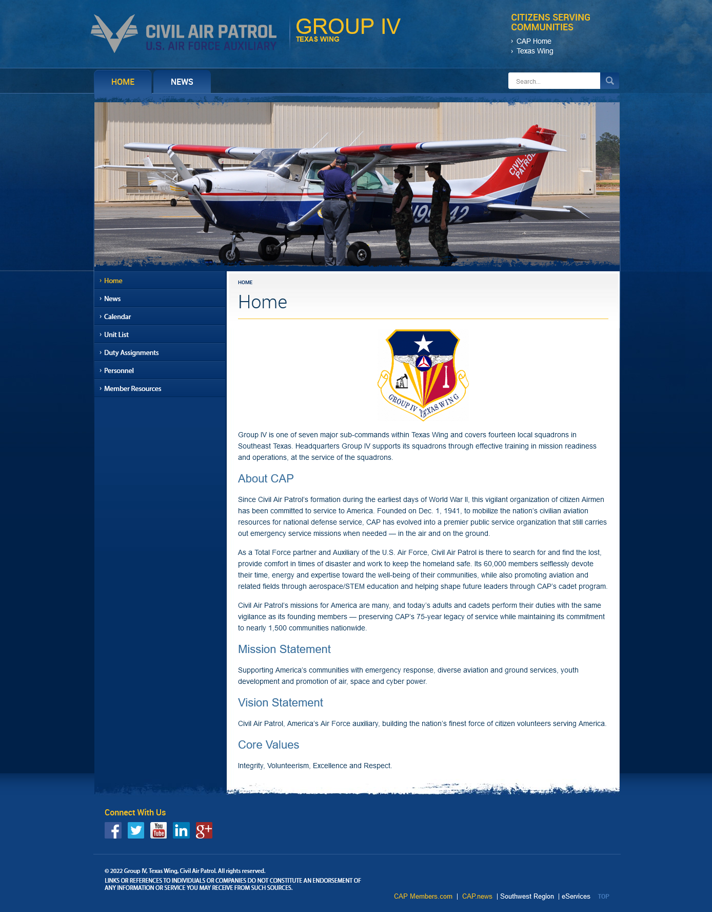

# Civil Air Patrol WordPress Theme

This template is from National Headquarter's [Branding Resource Guide](https://www.gocivilairpatrol.com/members/cap-national-hq/public-affairs-about/resource-library/toolkit/branding-resource-guide)
website template created by Global Reach.

A special "Thank you" to Maj Robert Bowden, CAP from GLR on his contributions 
to converting the template to WordPress. 

I have continued his work by adding several enhancements that I hope will make 
the administration of the site more friendly to those less familiar with PHP or 
HTML. 

-*1st Lt Jonathan Voss, CAP*

### Screenshot

### Features

* Title is driven by the configured Site Title

* Directly below the title is the configured tag line, useful for displaying
superior organization.

* All link areas have been converted to menus maintained by WordPress
    * Side menu supports two level menus

* Converted the slide show to a widget

* Changed all the footer columns to widgets

### Installation

1. Upload the "cap-wp-theme" folder to the "/wp-content/themes/" directory or
   upload the "cap-wp-theme.zip" file via the Theme Manager
2. Activate the Theme through the 'Themes' menu in WordPress
3. Go to "Appearance" > Theme options
4. Config theme as you need.

   Menu Options:
   * **Top Right Menu**: Top links under Citizens Serving Communities
   * **Tab Menu**: Tabbed buttons across the top of the slide show
   * **Main Menu**: Located on the left column of each page
   * **Footer Menu**: Manages links at the bottom right of the page. 
   Note: the two links in gold will always be present 
   
   Widgets:
   * **Slide Show**: Large centered image section. Size 1024x342.
   * **Footer Column 1**: By default displays Social Media links for CAP.
   * **Footer Column 2**: By default shows a description of its location, 
   replace as needed
   * **Footer Column 3**: By default shows a description of its location, 
   replace as needed
   * **Footer Column 4**: By default shows a description of its location, 
   replace as needed
